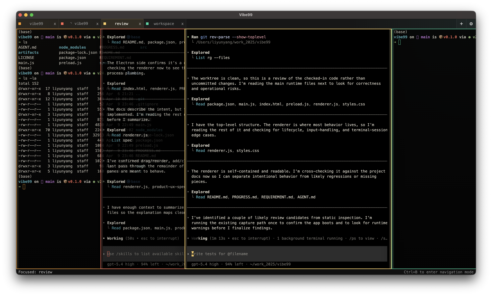

# Vibe99

Vibe99 is a cross-platform terminal management app for agentic coding. It is built around a simple idea: you usually want full focus on one terminal, while keeping lightweight peripheral awareness of the others.



## About

Vibe99 is a single-window terminal workspace for multi-agent and multi-context coding workflows. Instead of treating every terminal like an equal tile, Vibe99 gives one pane the readable body and compresses the rest into preview rails you can still track at a glance.

The product thesis is `focus + peripheral awareness`.

Today, Vibe99 is implemented as an Electron-based preview version with `xterm.js` and PTY-backed terminal sessions on macOS and Linux. The core interaction model is already real: overlapping panes, tab focus, drag reordering, navigation mode, and live terminals.

## Quick Start

Install dependencies and run the preview version locally:

```bash
npm install
npm start
```

For a static captured render:

```bash
npm run capture
```

## Beta Status

Vibe99 is in active preview/beta development. The core UX is already working well: overlapping panes, fast focus changes, live terminals, drag reordering, and navigation mode are all in place. Packaging, settings persistence, richer terminal metadata, and multi-window workflows are still being built.

The preferred way to run Vibe99 right now is `npm start`. Proper packaged desktop builds will come later.
